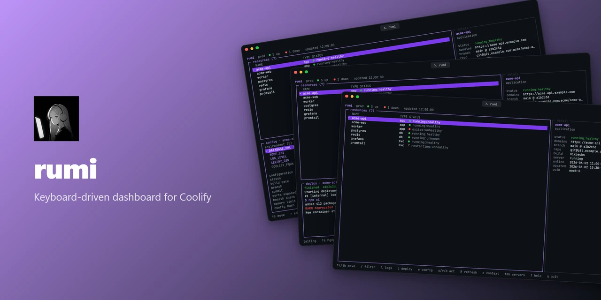
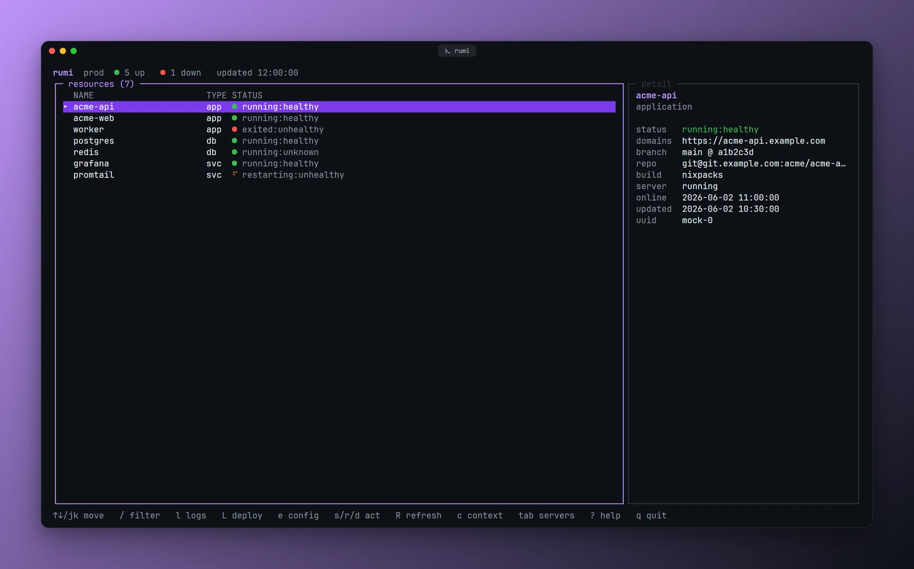
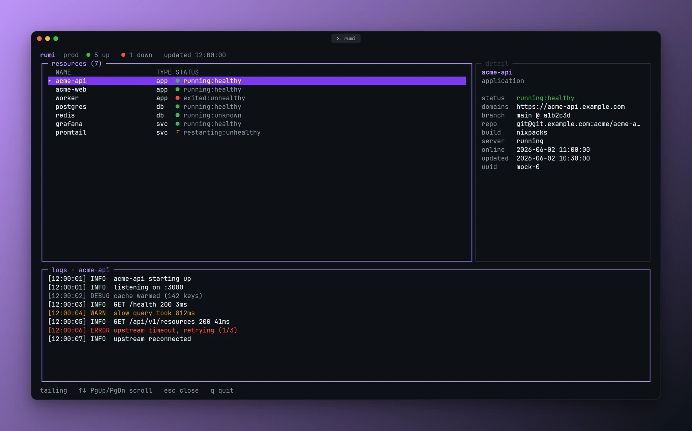
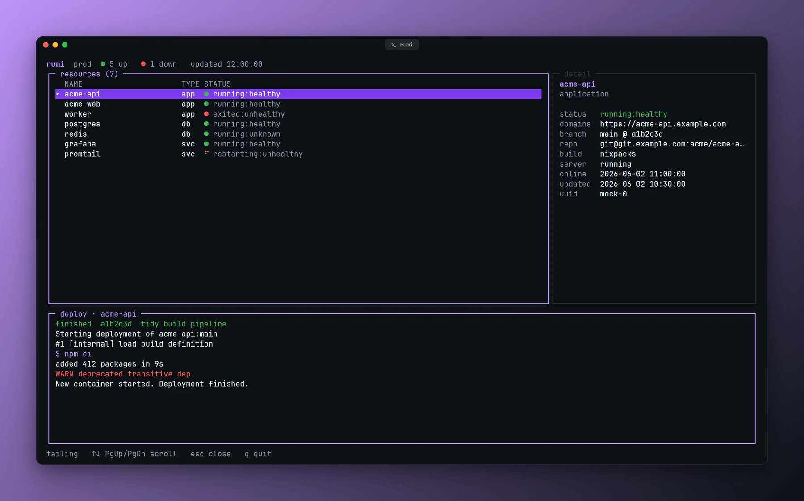
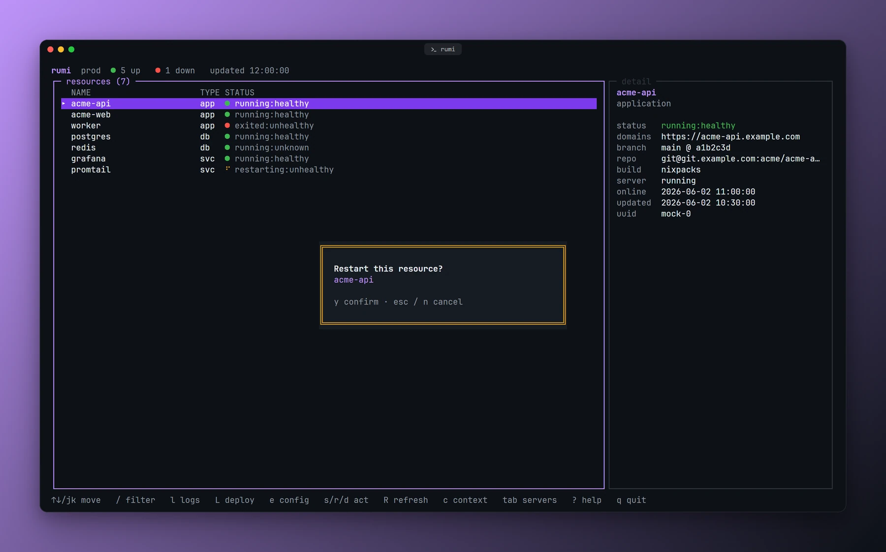
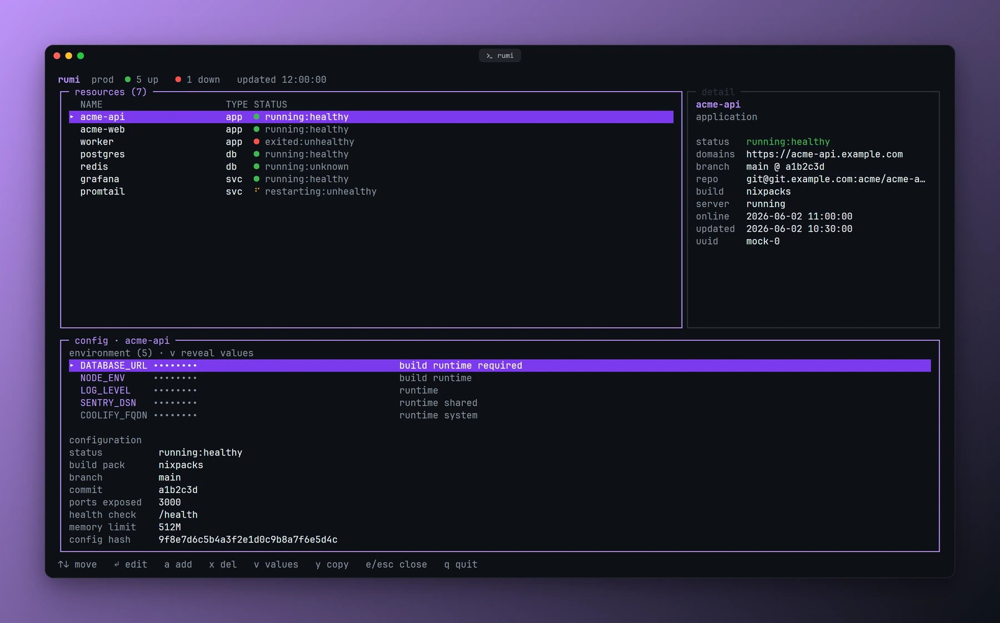
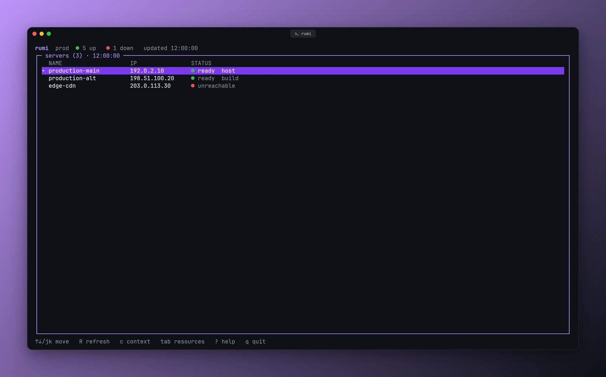
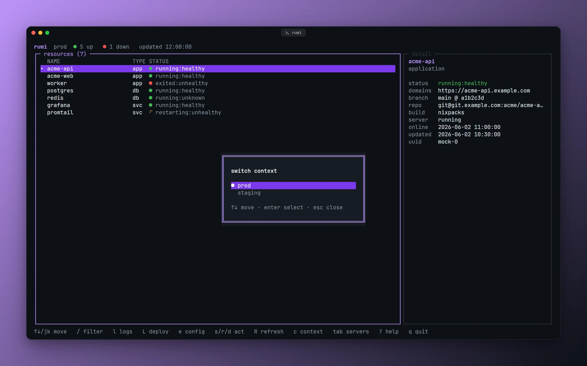
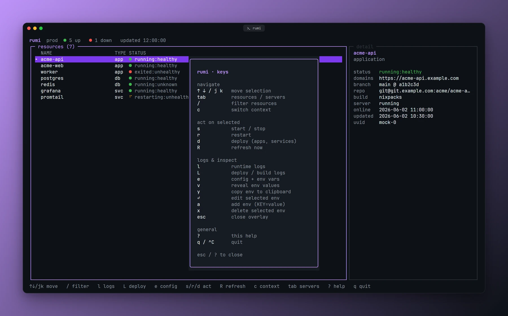

<div align="center">
  

  <h1>rumi</h1>

  <p><strong>A fast, keyboard-driven terminal dashboard for <a href="https://coolify.io">Coolify</a>.</strong></p>

  <p>
    <a href="https://github.com/Shironex/Rumi/releases/latest">
      
    </a>
    <a href="https://github.com/Shironex/Rumi/actions/workflows/ci.yml">
      
    </a>
    <a href="LICENSE">
      
    </a>
  </p>

  <p>
    <a href="#install"><strong>Install</strong></a>
    &nbsp;·&nbsp;
    <a href="https://github.com/Shironex/Rumi/releases"><strong>Releases</strong></a>
    &nbsp;·&nbsp;
    <a href="#keys"><strong>Keys</strong></a>
    &nbsp;·&nbsp;
    <a href="ROADMAP.md"><strong>Roadmap</strong></a>
  </p>

  <blockquote>
    <p>For anyone running Coolify who would rather stay at the keyboard: rumi lists your apps, services and
    databases, tails logs, and handles deploys, restarts and env vars without a browser tab.</p>
  </blockquote>

  <p><sub>rumi is pre-1.0 and moving fast, so expect rough edges before things settle. See <a href="ROADMAP.md">ROADMAP.md</a> for what has shipped and what is next.</sub></p>
</div>

---

### What is rumi?

I built rumi because switching to a browser tab just to check on a deploy or tail a log breaks my flow. It is a
terminal dashboard for Coolify: point it at your instance and it gives you the kind of view `k9s` gives Kubernetes,
but for Coolify's applications, services and databases. Every action that changes something (start, stop, restart,
deploy) sits behind a y/n confirm, and env var edits apply on the resource's next deploy, never immediately.

### Screenshots

<p align="center">
  
  <br /><sub>Moving through resources, opening logs and switching views, all from the keyboard.</sub>
</p>

<table>
  <tr>
    <td width="50%"></td>
    <td width="50%"></td>
  </tr>
  <tr>
    <td align="center"><sub>Every app, service and database on the instance, sorted by kind with live status.</sub></td>
    <td align="center"><sub>Tailing a running app&#39;s container logs.</sub></td>
  </tr>
  <tr>
    <td width="50%"></td>
    <td width="50%"></td>
  </tr>
  <tr>
    <td align="center"><sub>The latest build and deploy log for the selected app.</sub></td>
    <td align="center"><sub>Every start, stop, restart or deploy sits behind a y/n confirm.</sub></td>
  </tr>
  <tr>
    <td width="50%"></td>
    <td width="50%"></td>
  </tr>
  <tr>
    <td align="center"><sub>Curated deploy config and env vars, values masked until revealed.</sub></td>
    <td align="center"><sub>Reachability, usability and build-server flags for every host.</sub></td>
  </tr>
  <tr>
    <td width="50%"></td>
    <td width="50%"></td>
  </tr>
  <tr>
    <td align="center"><sub>Jump between configured Coolify instances without leaving the keyboard.</sub></td>
    <td align="center"><sub>Every key, one overlay away.</sub></td>
  </tr>
</table>

### What's inside

|                                |                                                                                                       |
| ------------------------------ | ----------------------------------------------------------------------------------------------------- |
| **Live resource list**         | Apps, services and databases with color-coded health, sorted by kind, filterable with `/`.            |
| **Lifecycle actions**          | Start/stop (`s`), restart (`r`), deploy (`d`), every one behind a y/n confirm.                        |
| **Runtime + deploy logs**      | Tail a container's logs (`l`) or its build/deploy log (`L`); a triggered deploy opens its log itself. |
| **Config + env inspector**     | A resource's curated deploy config and env vars (`e`); values stay masked until you press `v`.        |
| **Edit env vars in place**     | `↵` edits, `a` adds (`KEY=value`), `x` deletes; changes apply on the resource's next deploy.          |
| **Copy env as a `.env` block** | `y` in the inspector copies over OSC 52, so it works over SSH in terminals that support it.           |
| **Servers view**               | Reachability, usability and build-server flags for every host (`tab`).                                |
| **Multiple instances**         | Switch Coolify contexts with `c`; the choice is remembered between runs.                              |
| **Self-updating**              | `rumi update` pulls the latest release in place.                                                      |

### Built with

|          |                                                                                                           |
| -------- | --------------------------------------------------------------------------------------------------------- |
| Runtime  | [Bun](https://bun.sh) (CI runs the latest release)                                                        |
| UI       | [OpenTUI](https://github.com/anomalyco/opentui) (`@opentui/core`, `@opentui/react`) + React 19            |
| Language | TypeScript, strict                                                                                        |
| Tooling  | ESLint, Prettier, Husky + lint-staged, `bun test`, a render smoke test, tag-driven GitHub Actions release |

### Install

```sh
curl -fsSL https://raw.githubusercontent.com/Shironex/Rumi/main/install.sh | sh
```

This installs the right binary into `~/.local/bin` (override with `RUMI_INSTALL_DIR`); make sure that directory is on
your `PATH`. Prebuilt binaries: **macOS** (arm64 only for now, an Intel build is on the roadmap) and **Linux** (x64,
arm64).

#### Windows

```powershell
irm https://raw.githubusercontent.com/Shironex/Rumi/main/install.ps1 | iex
```

This drops `rumi.exe` into `%LOCALAPPDATA%\Programs\rumi` (override with `$env:RUMI_INSTALL_DIR`) and adds it to your
user `PATH`; open a new terminal and run `rumi`. You can also grab `rumi-windows-x64.exe` from the
[releases page](https://github.com/Shironex/Rumi/releases) by hand. Windows support is newer and still experimental:
builds are x64 only (arm64 Windows runs the x64 binary under emulation), and like every platform, the binary is only
published once the render smoke test passes on the Windows runner. `rumi update` works the same way there.

### Configuration

rumi reads its instances from the same file as the official [Coolify CLI](https://coolify.io/docs/get-started/cli):
`~/.config/coolify/config.json`, or `%APPDATA%\coolify\config.json` on Windows.

```json
{
  "instances": [
    { "name": "prod", "fqdn": "https://your-coolify.example.com", "token": "<api-token>", "default": true }
  ]
}
```

Create an API token in Coolify, then enable the API and allow-list your IP under **Settings → Advanced → API
Settings**. A token with the `read:sensitive` scope is needed to reveal env values; without it, rumi shows env keys
only. Editing env vars needs a token with **write** access too, and the changes apply on the resource's next deploy:
rumi does not redeploy for you.

### Usage

```sh
rumi            # launch the dashboard
rumi update     # update to the latest release
rumi --version  # print the version
rumi --help     # show help
```

### Keys

| Key           | Action                                                  |
| ------------- | ------------------------------------------------------- |
| `↑ ↓` / `j k` | move selection                                          |
| `tab`         | toggle resources / servers                              |
| `/`           | filter resources                                        |
| `c`           | switch Coolify context                                  |
| `s`           | start / stop                                            |
| `r`           | restart                                                 |
| `d`           | deploy                                                  |
| `R`           | refresh now                                             |
| `l`           | runtime logs                                            |
| `L`           | deploy / build logs                                     |
| `e`           | config + env inspector                                  |
| `v`           | reveal env values (in the inspector)                    |
| `y`           | copy env vars as a `.env` block (in the inspector)      |
| `↵`           | edit the selected env var (in the inspector)            |
| `a`           | add an env var, typed as `KEY=value` (in the inspector) |
| `x`           | delete the selected env var (in the inspector)          |
| `?`           | help                                                    |
| `q` / `^C`    | quit                                                    |

### Build from source

Requires [Bun](https://bun.sh) (CI runs the latest release).

```sh
bun install
bun run start            # run from source
bun run smoke            # headless render test
bun build --compile ./src/index.tsx --outfile rumi   # standalone binary
```

The splash art is generated from an image with `bun run scripts/make-splash.ts <image> --write` (needs `ffmpeg`).

### Showcase images

The images in this README come from the app itself, captured with
[`@noctcore/showcase-kit`](https://www.npmjs.com/package/@noctcore/showcase-kit). `bun run showcase` starts rumi with
`RUMI_MOCK=1` (invented sample data, a frozen clock) in a pseudo terminal, captures the eight views and the
keyboard-navigation clip, and rebuilds the hero banner. It runs under Node 22 or newer and needs Chromium once:
`bunx playwright install chromium`. The config lives in [`showcase.config.mjs`](showcase.config.mjs).

### Releases

Tag-driven: pushing a `vX.Y.Z` tag builds and publishes the compiled binaries (see
[`.github/workflows/release.yml`](.github/workflows/release.yml)). There is no `CHANGELOG.md` yet; release notes live
on the [releases page](https://github.com/Shironex/Rumi/releases).

### License

[MIT](LICENSE) © Shironex
